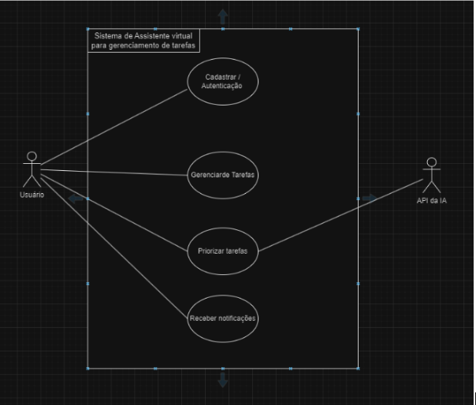

# Diagrama de caso de uso
O `sistema de gerenciamento de tarefas possui o seguinte` possui um diagrama de Caso de Uso, que ilustra os atores e os casos de uso principais do sistema, com foco nas interações do usuário com o sistema de login, gerenciamento de tarefas, priorização de tarefas, e notificações.

## Versão macro

### Cenário de caso de uso (CCU1)

Referente à cadastrar/autenticar usuários

| **Nome do caso de uso**        | Cadastrar/Autenticação de usuário                          |
| ------------------------------ | --------------------------------------------------------- |
| **Descrição**                  | Usuário vai fazer login ou se cadastrar no site            |
| **Atores**                     | Usuário                                                   |
| **Pré-Condições**              | Estar no navegador                                         |
| **Fluxo principal**            | 1. Usuário abre o site                               |
|                                | 2. Preenche os dados de nome e senha                       |
|                                | 3. O sistema confirma os dados                             |
|                                | 4. O usuário tem acesso ao sistema                         |
| **Fluxo alternativo**          | 1. O usuário digita nome ou senha inválido                 |
|                                | 2. O sistema exibe uma mensagem de erro e avisa para o usuário |
| **Regra de execução**          | Se já existir um nome de usuário, uma mensagem de erro deve ser exibida solicitando que o usuário escolha outro nome. |

### Cenário de caso de uso (CCU2)
Referente ao requisito funcional 1 (RF1:`Tarefas`)

| **Nome do caso de uso**        | Gerenciar tarefas                                           |
| ------------------------------ | ----------------------------------------------------------- |
| **Descrição**                  | Criar, ler, editar e excluir tarefas                        |
| **Atores**                     | Usuário                                                     |
| **Pré-Condições**              | Usuário deve estar logado                                   |
| **Fluxo principal**            | 1. Usuário escolhe o que quer fazer com a tarefa            |
|                                | 2. O dado vai ser atualizado no banco de dados              |
| **Fluxo alternativo**          | 1. O sistema não consegue atualizar o banco de dados        |
|                                | 2. O sistema informa que não foi possível confirmar a ação |
| **Regra de execução**          | O sistema deve validar os dados (campos) da tarefa antes de atualizar o banco de dados |

